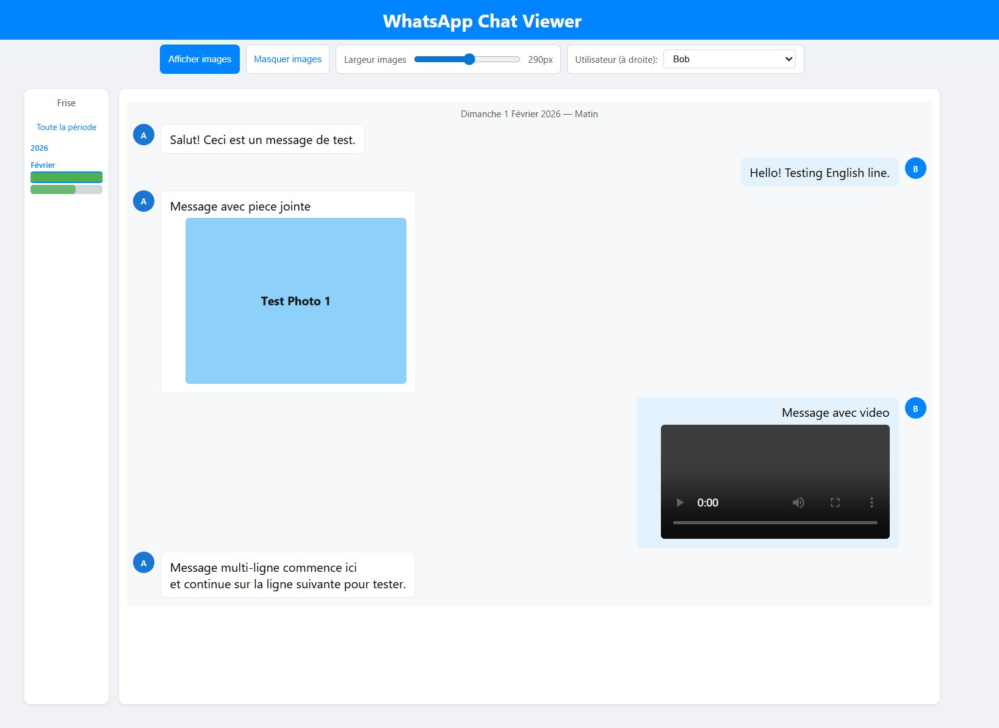

# WhatsApp Chat Viewer

Local viewer for a WhatsApp export (`_chat.txt`) with timeline, media, and printing.



## Prerequisites: export a WhatsApp chat (with or without media)

### iPhone (iOS)

1. Open WhatsApp and the chat to export.
1. Tap the contact or group name at the top.
1. Choose **Export Chat**.
1. Choose **Without Media** or **Include Media**.
1. Save to Files or share the file to your computer.

### Android

1. Open WhatsApp and the chat to export.
1. Menu (3 dots) in the top-right.
1. **More** → **Export chat**.
1. Choose **Without media** or **Include media**.
1. Save or share the file.

### In this project

1. Rename the exported text file to `_chat.txt`.
1. If you chose **Include media**, unzip the archive if needed.
1. Put `_chat.txt` and the media files in the same folder as `whatsapp-viewerV2.html`.
1. Dates in **DD/MM/YYYY** are supported. US exports **MM/DD/YYYY** are auto-detected. If ambiguous (e.g. 01/02/2026), day/month is assumed.
1. English bracket format is supported: `[MM/DD/YY, H:MM:SS AM] Name: Message` (with `AM/PM`).

## Quick start

1. Open `whatsapp-viewerV2.html`.
1. `_chat.txt` loads automatically if the page is served by a local server.
1. If auto-load fails (blocked by `file://`), use **Choose _chat.txt**.

## Run a local server (recommended)

Simple option with Python:

```powershell
python -m http.server 8000
```

Then open `http://localhost:8000/whatsapp-viewerV2.html`.

## Printing

- Custom print header/footer are enabled (title + page number).
- To remove the browser header/footer, disable the option in the print dialog.

## `_chat.txt` correction script

The script `correct_chat_local.py` fixes spelling and grammar via the OpenAI API.

Useful environment variables:

- `OPENAI_API_KEY` (required)
- `OPENAI_API_BASE` (optional, default `https://api.openai.com/v1`)
- `OPENAI_MODEL` (optional, default `gpt-4o-mini`)
- `LOCAL_OPENAI_MAX_CHARS` (optional, default `30000`)
- `LOCAL_OPENAI_MERGE_ONLY` (optional, `1/true/yes` to merge only)

Run:

```powershell
python correct_chat_local.py
```

Generated files are ignored by `.gitignore`.
